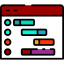

    

<!-- Social icons section -->

    
    &#8287;&#8287;&#8287;&#8287;&#8287;
    
    &#8287;&#8287;&#8287;&#8287;&#8287;
    
    &#8287;&#8287;&#8287;&#8287;&#8287;
    
    &#8287;&#8287;&#8287;&#8287;&#8287;
    

&#8287;&#8287;&#8287;&#8287;&#8287;
     

    
     
    

   

    
       

    &nbsp;
    &nbsp;
    &nbsp;
    &nbsp;
    &nbsp;
    &nbsp;
     
    &nbsp;
    &nbsp;
    &nbsp;
    &nbsp;
    &nbsp;
     
    &nbsp;
    &nbsp;
    &nbsp;
    &nbsp;
    &nbsp;
     
    &nbsp;
     
    &nbsp;
    &nbsp;
    &nbsp;

   

    

 

  

    
    
     

